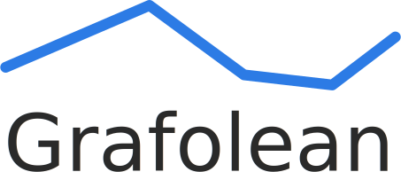

<p align="center"><a href="https://grafolean.com/"></a></p>

<h3 align="center">Easy to use monitoring system</h3>

---

- [Highlights](#highlights)
- [Installation](#installation)
- [Quick start - sending values to Grafolean](#quick-start---sending-values-to-grafolean)
- [Guides](#guides)
- [Privacy](#privacy)
- [License](#license)

---

## Highlights

- demo: https://app.grafolean.com/ (use credentials `demo` / `demo`)
- self-hosted or [hosted service](https://app.grafolean.com/)
- [API-first](https://app.grafolean.com/api-doc/)
- built-in or remote agents ("bots")
- UI-controlled agents (bots) for [NetFlow](doc/HOWTO-NetFlow.md), ICMP ping and SNMP (SNMPv1, SNMPv2 and SNMPv3)
- uses PostgreSQL / TimescaleDB as data storage (easy data maintenance)
- granular permissions model
- support for [custom dashboard widgets via plugins](https://github.com/grafolean/widget-plugin-template)


## Installation

Before starting, make sure that both Docker ([installation instructions](https://docs.docker.com/install/)) and Docker Compose ([installation instructions](https://docs.docker.com/compose/install/)) are installed.

1) save [install/docker-compose.yml](https://raw.githubusercontent.com/grafolean/grafolean/master/install/docker-compose.yml) to a local file:

    ```
    $ curl https://raw.githubusercontent.com/grafolean/grafolean/master/install/docker-compose.yml > docker-compose.yml
    ```

2) save [.env.example](https://raw.githubusercontent.com/grafolean/grafolean/master/install/.env.example) to a local file and rename it to `.env`:

    ```
    $ curl https://raw.githubusercontent.com/grafolean/grafolean/master/install/.env.example > .env
    ```

3) edit `.env`, for example with `nano`:
    ```
    $ nano .env
    ```
     and change the settings:

    - mandatory: `EXTERNAL_HOSTNAME` (set to the IP/hostname of the server as seen from the outside - for example `grafolean.example.com` or `198.51.100.12`),
    - optional but recommended: DB admin credentials and the path where the DB data will be saved locally (`/grafolean-db/` by default).

4) run:
    ```
    $ docker-compose up -d
    ```

5) point your browser to `http://<IP or domain>/` (where `<IP or domain>` should be the same as `EXTERNAL_HOSTNAME` in step 3)

Congratulations, you are done! :rocket:

If you wish to setup HTTPS, see [doc/HOWTO-HTTPS.md](doc/HOWTO-HTTPS.md) for instructions.

### Upgrading

```
$ docker-compose pull
$ docker-compose down
$ docker-compose up -d
```

## Sending values to Grafolean (custom bots)

You can send data to Grafolean from your own scripts ("custom bots") or you can use one of the existing bots, which can even be configured from within the Grafolean (like ICMP ping, SNMP or Netflow - see [Grafolean User Guide](doc/user-guide.md)).

When you just want to send values to Grafolean, create a *custom* bot (via UI) and obtain its token. Then you can use a regular POST request to send values:

```bash
$ curl -X POST 'https://app.grafolean.com/api/accounts/1/values/?p=myhouse.livingroom.humidity&v=57.3&b=<BotAPIToken>'
```

The values can now be shown through dashboards.

[User Guide](doc/user-guide.md) explains the core concepts and guides you further. See also [backend/API.md](backend/API.md) for more info on API.


## Guides

- [User Guide](doc/user-guide.md) - core concepts and first steps
- [NetFlow Guide](doc/HOWTO-NetFlow.md) - step-by-step NetFlow monitoring setup guide
- [HTTPS](doc/HOWTO-HTTPS.md) - configuring Grafolean to use SSL/TLS
- [API Guide](backend/API.md)
- [Development Guide](doc/HOWTO-dev.md)


## Privacy

We do our best to make sure no 3rd party receives any data from your installation of Grafolean or from your users.

If frontend, we are using [Content Security Policy (CSP)](https://developer.mozilla.org/en-US/docs/Web/HTTP/CSP) to disallow loading of any resources except from the host itself. The limit also applies to external plugins.

The backend should make no requests to the external services, except to:
- `https://app.grafolean.com/` - if telemetry is enabled (see below), and
- `https://github.com/` - when admin installs or upgrades [external plugins](https://github.com/grafolean/widget-plugin-template).

Note that this list might be updated in the future - however, we will make an effort to avoid any tracking that is not strictly necessary.

### Telemetry

Telemetry can be disabled by setting `TELEMETRY=none` in the `.env` file when starting Grafolean (as indicated in `.env.example`). The default telemetry is `basic` and allows us to determine active installations of the app (app start, daily "ping"). We would appreciate if you leave the basic telemetry enabled as it helps us to focus our efforts on what matters the most, but we understand if you have concerns about it and decide to turn it off. We will not allow 3rd parties access to telemetry data, but we might publish aggregated data through public channels (blogs,...).

## License

This software is free to use for any purpose, to inspect, modify and share, except to sell to third parties.

[License](LICENSE.md) is Commons Clause license (on top of Apache 2.0), which means that source is available and you can use it free-of-charge forever (both non-commercially and commercially), modify it and share modifications. The license limits the ability to sell Grafolean to third parties (for example as product, offering support,...), as you would need a commercial license for that (not yet available, [contact us](mailto:info@grafolean.com) if interested). Open an [issue](https://github.com/grafolean/grafolean/issues) or [ask directly](mailto:info@grafolean.com) if in doubt.
