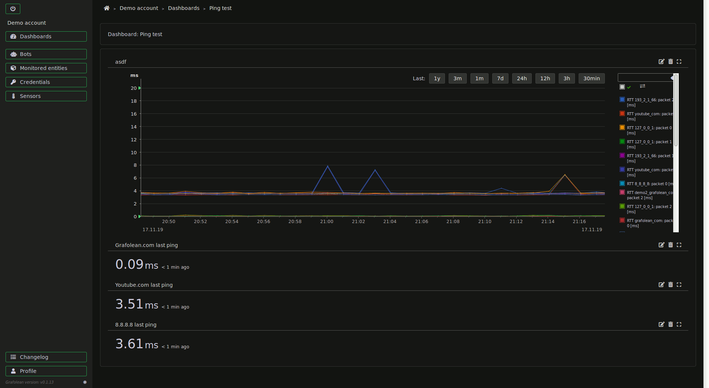

# Grafolean

Easy to use monitoring system:

- self-hosted or hosted service
- light on resources
- [API-first](https://grafolean.com/api-doc/)
- remote agents (bots)
- UI-controlled agents (bots) for ICMP ping and SNMP (SNMPv1, SNMPv2 and SNMPv3 - netsnmp compatible) - with more coming
- auto-updating UI
- uses PostgreSQL as data storage (easy maintenance)
- granular permissions model
- ...

Demo: https://grafolean.com/ (`demo` / `demo`)

[User Guide](doc/user-guide.md) explains the core concepts and guides you through the first steps.



## Install

Requirements: `docker` and `docker-compose` must be installed. Installation guide assumes Linux environment.

1) save [install/docker-compose.yml](https://raw.githubusercontent.com/grafolean/grafolean/master/install/docker-compose.yml) to a local file:

    ```
    $ curl https://raw.githubusercontent.com/grafolean/grafolean/master/install/docker-compose.yml > docker-compose.yml
    ```

2) save [.env.example](https://raw.githubusercontent.com/grafolean/grafolean/master/install/.env.example) to a local file and rename it to `.env`:

    ```
    $ curl https://raw.githubusercontent.com/grafolean/grafolean/master/install/.env.example > .env
    ```

3) edit `.env` and change:
    - mandatory: `EXTERNAL_HOSTNAME` (set to the IP/hostname of the server as seen from the outside),
    - optional but recommended: DB admin credentials and the path where the DB data will be saved locally (`/grafolean-db/` by default).

    ```
    $ nano .env
    ```

4) run:
    ```
    $ docker-compose up -d
    ```

5) point your browser to `http://<IP or domain>/` (where `<IP or domain>` should be the same as `EXTERNAL_HOSTNAME` in step 3)

Congratulations, you are done! :)

If you wish to setup HTTPS, see [doc/HOWTO-HTTPS.md](doc/HOWTO-HTTPS.md) for instructions.

## Upgrade

```
$ docker-compose pull
$ docker-compose down
$ docker-compose up -d
```

## Sending values to Grafolean

SNMP and ICMP Ping bots are part of the installed services, and they are controlled from the Grafolean UI. See [Grafolean User Guide](doc/user-guide.md).

You can still send any values to Grafolean using a *custom* bot though. First you need to create a bot (via UI) and obtain its token. Then you can use a regular POST request to send values:

```bash
$ curl -X POST 'https://grafolean.com/api/accounts/1/values/?p=myhouse.livingroom.humidity&v=57.3&b=<BotAPIToken>'
```

See [backend/API.md](backend/API.md) for more info.

## Development

See [doc/HOWTO-dev.md](doc/HOWTO-dev.md) for details.

## License

License is Commons Clause license (on top of Apache 2.0) - source is available and you can use it for free (commercially too), modify it and
share modifications. To sell it however you need a commercial license (not yet available - [contact us](info@grafolean.com) if
interested). See [LICENSE.md](./LICENSE.md) for details.

If in doubt, please [open an issue](https://github.com/grafolean/grafolean/issues) to get further clarification.
