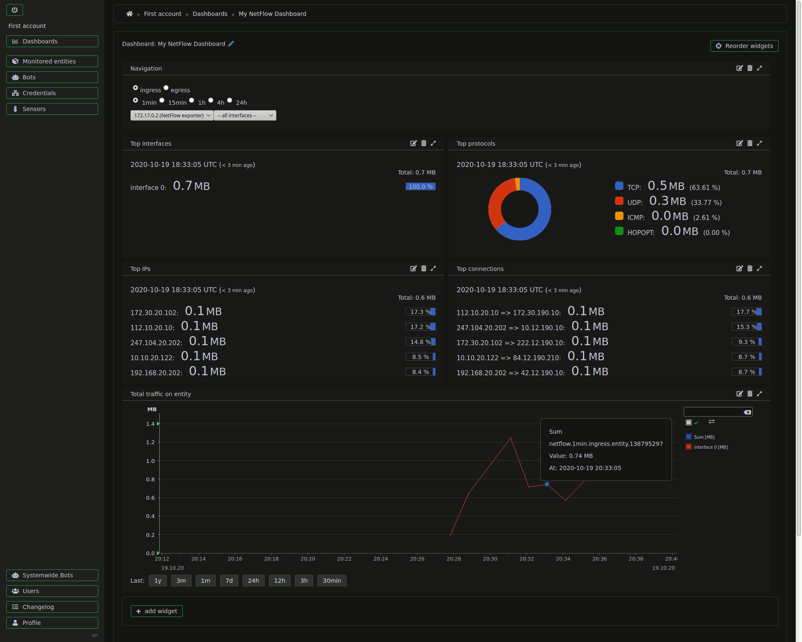

# NetFlow

This guide is also available as video ([vimeo](https://vimeo.com/463939591) / [youtube](https://youtu.be/5p32cFvvQ5A)).

## Configuration

#### 1) Installation

To collect data, NetFlow bot needs to be installed and configured. This already happens by default during [installation of Grafolean](https://github.com/grafolean/grafolean#installation). The alternative option is to install NetFlow bot on a [remote machine](https://github.com/grafolean/grafolean-netflow-bot/#install).

#### 2) Enable (suggested) entity

Grafolean helps with configuration by automatically creating the entities for any NetFlow exporter it receives data from (see "Monitored entities"). Note that it may take up to 2 minutes for the suggestions to appear.

However, these entities are not automatically enabled. To do so, click on the name of the entity (which is IP + `"(NetFlow exporter)"` by default) -> Settings:

Then edit the settings for NetFlow protocol:
- for Credentials select `Default NetFlow credential`
- for Bot select `Systemwide NetFlow bot`
- at last, enable `Default NetFlow sensor`

Don't forget to save changes by clicking the `Submit` button.

#### 3) View data

Grafolean should now be collecting the data automatically. To view it, create a new Dashboard, but make sure you select "NetFlow" template. This will automatically populate the dashboard with the widgets that are useful for this kind of data. Of course, you can always modify the existing widgets, add new ones (even those unrelated to NetFlow) or remove those that are not needed.

- click Dashboards in the menu -> Add dashboard
- enter dashboard name and in the dropdown "Initialize using a template" choose `NetFlow`

**IMPORTANT:** It might take up to 5 minutes (with default settings for NetFlow bot's `JOBS_REFRESH_INTERVAL`) for enough data to be collected. If you see a message `It looks like there is no NetFlow data available for any entity yet` in your dashboard (in NetFlow Navigation Widget - the one on the top), it means that the data was not aggregated and sent to Grafolean yet. Please wait, the page should update automatically. If there is no change after 5 minutes, review the steps above one more time. Alternatively, you can check the [NetFlow Bot docker logs](https://github.com/grafolean/grafolean-netflow-bot/#debugging) to make sure the data is being collected and sent to Grafolean.

Final result:

